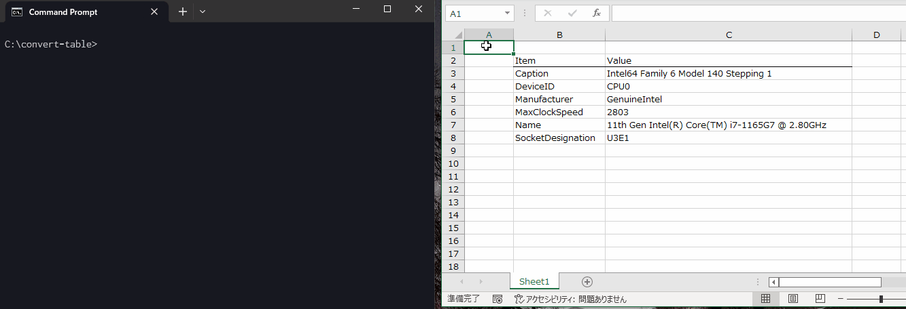

# convert-table


[](LICENSE)

<!-- [Japanese page](./README.ja.md)   -->

## Overview
Interconvert various plaintext tables.

## Requirements
- Python3 only

## Usage

```sh
$ python ctbl.py -h
usage: ctbl.py [-h] [-i I] [-o O]

Planetext Table Comverter.

  Input/Output types:
    csv   : comma separated values.
    tsv   : tab separated values (like copied from spreadsheet)
    md    : markdown style table
    ascii : Ascii style table (similar to reST's grid style, but cell merge is not available)

options:
  -h, --help  show this help message and exit
  -i I        input type
  -o O        output type
```

## Example
### stdin to stdout (on Windows)

```sh
$ python ctbl.py -i csv -o ascii
aaa,bbb,ccc          <---- input from keyboard
ddd,eee,fff          <---- input from keyboard
ggg,hhh,iii^Z        <---- input from keyboard (On Windows, Ctrl+Z to exit stdin)
+-----+-----+-----+  <---- output after this line
| aaa | bbb | ccc |
+-----+-----+-----+
| ddd | eee | fff |
+-----+-----+-----+
| ggg | hhh | iii |
+-----+-----+-----+
```

### stdin to stdout (on Linux)

```sh
$ python ctbl.py -i csv -o ascii
aaa,bbb,ccc          <---- input from keyboard
ddd,eee,fff          <---- input from keyboard
ggg,hhh,iii          <---- input from keyboard (On Linux, Ctrl+D to exit stdin)
+-----+-----+-----+
| aaa | bbb | ccc |
+-----+-----+-----+
| ddd | eee | fff |
+-----+-----+-----+
| ggg | hhh | iii |
+-----+-----+-----+
```

### file to file
Use redirection in the shell.  

```sh
$ cat input.csv
aaa,bbb,ccc
ddd,eee,fff
ggg,hhh,iii

$ python ctbl.py -i csv -o ascii < input.csv > output.txt

$ cat output.txt
+-----+-----+-----+
| aaa | bbb | ccc |
+-----+-----+-----+
| ddd | eee | fff |
+-----+-----+-----+
| ggg | hhh | iii |
+-----+-----+-----+
```

### MS Excel(tsv) to ascii



Note:  
This is an example using Windows Terminal. If Command Prompt is used, tab characters cannot be pasted.  
